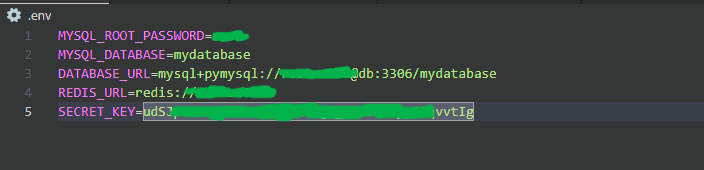

### Configurando o Backend

1. Entre na pasta do backend:

   ```sh
   $ cd backend
   ```

2. Crie um ambiente virtual para instalar as dependências:

   ```sh
   $ python -m venv venv
   $ source venv/bin/activate  # Para Linux/Mac
   $ venv\Scripts\activate   # Para Windows
   ```

3. Instale as dependências do backend:

   ```sh
   (venv) $ pip install -r requirements.txt
   ```

4. Configure o banco de dados MySQL e o arquivo `.env` na raiz do backend com as variáveis de ambiente necessárias, como credenciais do banco de dados e segredo JWT.

<div align="center">
  
</div>
                 
5. Execute as migrações do banco de dados com o Alembic:

   ```sh
   (venv) $ alembic upgrade head
   ```

### Configurando o Frontend

1. Entre na pasta do frontend:

   ```sh
   $ cd ../frontend
   ```

2. Instale as dependências do frontend:

   ```sh
   $ npm install
   ```

3. Crie um arquivo `.env.local` na raiz do frontend e configure a URL do backend (por exemplo, `NEXT_PUBLIC_API_URL=http://localhost:8000`).

## 🌄 Rodando o Projeto

### Rodando com Docker

O projeto possui um arquivo `docker-compose.yml` para facilitar a execução com Docker. Para rodar tanto o backend quanto o frontend usando Docker, execute:

```sh
$ docker-compose up --build
```

Isso irá criar e iniciar os contêineres necessários.

### Rodando Manualmente

#### Backend

1. Entre na pasta do backend e ative o ambiente virtual:

   ```sh
   $ cd backend
   $ source venv/bin/activate
   ```

2. Inicie o servidor FastAPI:

   ```sh
   (venv) $ uvicorn main:app --reload
   ```

#### Frontend

1. Em outra janela do terminal, entre na pasta do frontend:

   ```sh
   $ cd frontend
   ```

2. Inicie o servidor Next.js:

   ```sh
   $ npm run dev
   ```

O frontend estará acessível em [http://localhost:3000](http://localhost:3000).

## 🌐 Estrutura do Projeto

```
Api_fullstack/
|
├── backend/                  # Backend FastAPI
│   ├── app/                  # Código principal da aplicação
│   ├── alembic/              # Migrações do banco de dados
│   ├── Dockerfile            # Dockerfile para o backend
│   └── requirements.txt      # Dependências do backend
|
├── frontend/                 # Frontend Next.js
│   ├── components/           # Componentes reutilizáveis
│   ├── pages/                # Páginas do Next.js
│   ├── styles/               # Arquivos CSS
│   ├── Dockerfile            # Dockerfile para o frontend
│   └── package.json          # Dependências do frontend
|
└── docker-compose.yml        # Arquivo Docker Compose
```

## 🛡️ Utilizando a API

- A documentação da API pode ser acessada em [http://localhost:8000/docs](http://localhost:8000/docs) após rodar o backend. Aqui você encontrará todos os endpoints disponíveis, além de poder testar cada um deles diretamente.

- As principais funcionalidades incluem cadastro de empresas, criação de usuários, autenticação via JWT, e troca de mensagens entre operadores e admins.

## 📢 Contribuindo

Contribuições são bem-vindas! Siga os passos abaixo para contribuir:

1. Faça um fork do projeto.
2. Crie uma branch para sua feature ou correção de bug (`git checkout -b feature/nome_da_feature`).
3. Faça commit das suas alterações (`git commit -m 'Adicionando nova feature'`).
4. Faça push para a branch (`git push origin feature/nome_da_feature`).
5. Abra um Pull Request.

## 📄 Licença

Este projeto está sob a licença MIT. Consulte o arquivo [LICENSE](LICENSE) para mais informações.

